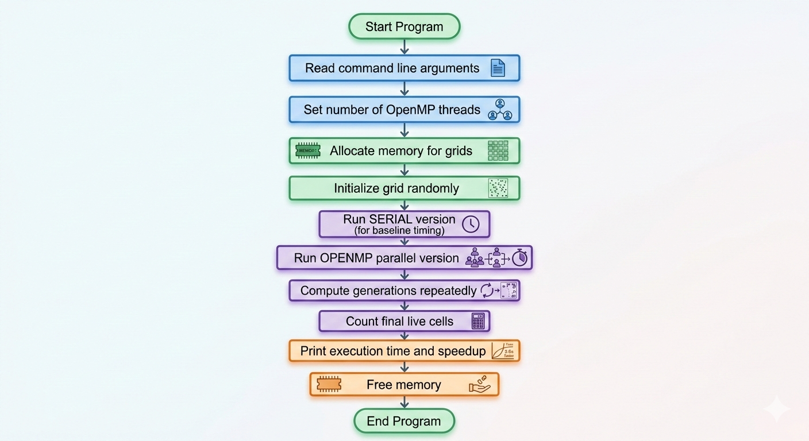

# Conway's Game of Life – OpenMP Implementation

This directory contains the **OpenMP parallel implementation** of Conway's Game of Life.  
OpenMP is used to speed up the computation by executing the simulation using **multiple CPU threads**.

The goal of this implementation is to demonstrate how **shared-memory parallel programming** can improve the performance of a computational simulation.

---

# What is Conway's Game of Life?

Conway's Game of Life is a **cellular automaton simulation** created by mathematician John Conway.

The simulation runs on a **2D grid of cells** where each cell can be:

- **Alive (1)**
- **Dead (0)**

Each cell interacts with its **8 neighboring cells**.

### Example Grid



Each simulation step is called a **Generation**.

---

# Game of Life Rules

For every generation, the state of each cell is updated based on its neighbors.

### Rule 1 – Underpopulation
A live cell with **fewer than 2 neighbors** dies.

### Rule 2 – Survival
A live cell with **2 or 3 neighbors** survives.

### Rule 3 – Overpopulation
A live cell with **more than 3 neighbors** dies.

### Rule 4 – Reproduction
A dead cell with **exactly 3 neighbors** becomes alive.

---

# Why Use OpenMP?

The Game of Life simulation must update **every cell in the grid** for every generation.

For large grids this becomes computationally expensive.

Example:

```
Grid size = 1000 × 1000
Cells = 1,000,000
Generations = 1000
```

Total cell updates:

```
1,000,000 × 1000 = 1,000,000,000 updates
```

Using **OpenMP**, we can distribute this work across **multiple CPU cores**, significantly reducing execution time.

---

# Parallelization Strategy

The grid update is parallelized using OpenMP.

Each thread processes **different cells of the grid simultaneously**.

OpenMP directive used:

```c
#pragma omp parallel for collapse(2)
```

This directive parallelizes the **nested loops** that iterate over the grid rows and columns.

### Why `collapse(2)`?

The grid is processed using two nested loops:

```c
for (int i = 0; i < rows; i++)
{
    for (int j = 0; j < cols; j++)
```

`collapse(2)` combines these two loops into a **single iteration space**, allowing OpenMP to distribute the work more evenly among threads.

This improves **load balancing and CPU utilization**.

---

# OpenMP Reduction

To count the total number of live cells safely across threads, the program uses:

```c
#pragma omp parallel for reduction(+:count)
```

This prevents **race conditions** when multiple threads update the same variable.

Each thread keeps a **local copy** of the variable, and OpenMP combines them at the end.

---

# Program Execution Flow

The program follows these steps during execution:

```
Start Program
     ↓
Read command line arguments
     ↓
Set number of OpenMP threads
     ↓
Allocate memory for grids
     ↓
Initialize grid randomly
     ↓
Run SERIAL version (for baseline timing)
     ↓
Run OPENMP parallel version
     ↓
Compute generations repeatedly
     ↓
Count final live cells
     ↓
Print execution time and speedup
     ↓
Free memory
     ↓
End Program
```

---

# Building the Program

Compile using **GCC with OpenMP support**.

```bash
gcc -fopenmp gol_openmp.c -o gol_openmp
```

---

# Running the Program

```
./gol_openmp [rows] [cols] [generations] [threads]
```

### Example

```bash
./gol_openmp 1000 1000 500 4
```

Parameters:

| Parameter   | Description                |
| ----------- | -------------------------- |
| rows        | Number of grid rows        |
| cols        | Number of grid columns     |
| generations | Number of simulation steps |
| threads     | Number of OpenMP threads   |

---

# Example Output

```
Grid Size: 1000x1000
Generations: 500
OpenMP Threads: 4

Serial Execution Time: 12.45 seconds
OpenMP Execution Time: 3.18 seconds
Speedup: 3.91x

Final Live Cell Count: 235421
```

---

# Performance Measurement

The program runs two versions:

1. **Serial Version**
2. **OpenMP Parallel Version**

Speedup is calculated using:

```
Speedup = Serial Execution Time / Parallel Execution Time
```

This helps evaluate the effectiveness of **parallelization**.

---

# Key OpenMP Concepts Demonstrated

This implementation demonstrates the following OpenMP concepts:

* Shared memory parallel programming
* Parallel loops
* Loop collapsing
* Reduction operations
* Thread management

---

# Summary

This OpenMP implementation demonstrates how a **data-parallel problem like Conway's Game of Life** can be efficiently accelerated using **multi-core CPU parallelism**.

By distributing grid computations across threads, the simulation achieves significant performance improvements compared to the serial version.
